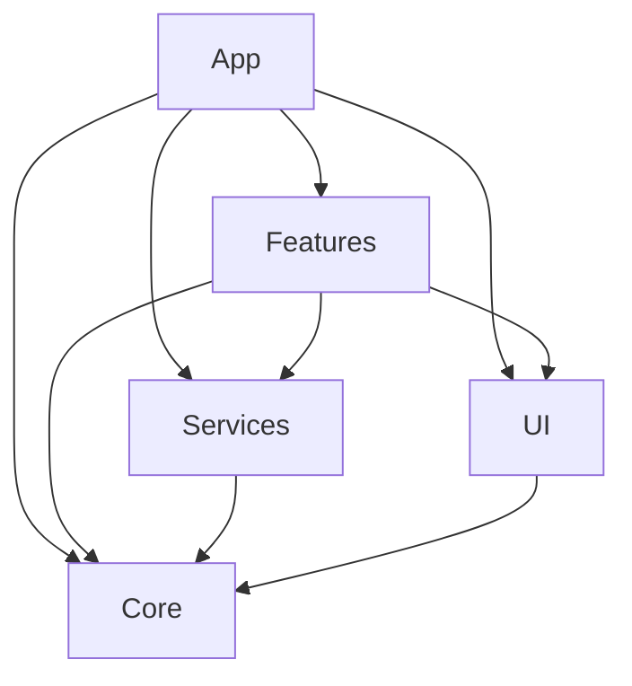

# Cấu Trúc Dự Án

Hiểu rõ cấu trúc project để navigate và phát triển hiệu quả.

---

## Mục Lục

- [Tổng Quan](#tổng-quan)
- [Kiến Trúc Multi-Module](#kiến-trúc-multi-module)
- [Chi Tiết Từng Module](#chi-tiết-từng-module)
- [Dependency Graph](#dependency-graph)
- [File Organization](#file-organization)
- [Naming Conventions](#naming-conventions)

---

## Tổng Quan

iOS Template sử dụng **Multi-Module Architecture** với Swift Package Manager (SPM) để tổ chức code thành các modules độc lập, dễ test và maintain.

### Project Structure

```
IOSTemplate/
├── Sources/                    # Source code
│   ├── App/                   # Application entry point
│   ├── Core/                  # Foundation layer
│   ├── UI/                    # Design system
│   ├── Services/              # External services
│   └── Features/              # Business features
│
├── Tests/                      # Unit tests
│   ├── CoreTests/
│   └── FeaturesTests/
│
├── docs/                       # User documentation (bạn đang đọc)
├── ios-template-docs/          # Internal development docs
├── progress/                   # Task tracking
├── Scripts/                    # Build scripts
│
├── Package.swift               # SPM manifest
├── IOSTemplate.xcodeproj       # Xcode project
├── lint.sh                     # SwiftLint script
└── README.md                   # Project overview
```

---

## Kiến Trúc Multi-Module

Template được chia thành **5 modules chính** theo layers:

```
┌─────────────────────────────────────┐
│            App Layer                │  Entry point, RootView
│         (App module)                │
├─────────────────────────────────────┤
│          Features Layer             │  Business logic
│       (Features module)             │  Home, Settings, IAP, Onboarding
├─────────────────────────────────────┤
│         Services Layer              │  External integrations
│       (Services module)             │  Firebase, Payment, Ads
├─────────────────────────────────────┤
│           UI Layer                  │  Design system
│         (UI module)                 │  Theme, Components
├─────────────────────────────────────┤
│           Core Layer                │  Foundation
│        (Core module)                │  Architecture, Dependencies, Navigation
└─────────────────────────────────────┘
```

### Layer Dependencies

```
App      →  Features, Services, UI, Core
Features →  Services, UI, Core
Services →  Core
UI       →  Core
Core     →  (không phụ thuộc module nào)
```

**Quy tắc:**
- ✅ Upper layers có thể dùng lower layers
- ❌ Lower layers KHÔNG được dùng upper layers
- ✅ Cùng layer có thể depend vào nhau (với caution)

---

## Chi Tiết Từng Module

### 1. App Module

**Mục đích:** Application entry point và root-level logic.

**Location:** `Sources/App/`

**Responsibilities:**
- ✅ App lifecycle management
- ✅ Root state management (AppState, AppAction, AppReducer)
- ✅ Top-level navigation
- ✅ Root view rendering

**File Structure:**

```
Sources/App/
├── Main.swift              # @main entry point
├── AppState.swift          # Root state
├── AppAction.swift         # Root actions
├── AppReducer.swift        # Root reducer
└── RootView.swift          # Root SwiftUI view
```

**Key Files:**

| File | Mô tả |
|------|-------|
| `Main.swift` | Entry point, Firebase initialization |
| `AppState.swift` | Root state chứa tất cả feature states |
| `AppAction.swift` | Root actions (tab changes, lifecycle events) |
| `AppReducer.swift` | Root reducer tích hợp tất cả feature reducers |
| `RootView.swift` | Root view với TabView, onboarding, modals |

---

### 2. Core Module

**Mục đích:** Foundation layer - shared utilities và infrastructure.

**Location:** `Sources/Core/`

**Responsibilities:**
- ✅ TCA architecture setup
- ✅ Dependency injection
- ✅ Navigation system
- ✅ Error handling
- ✅ Cache system

**File Structure:**

```
Sources/Core/
├── Architecture/           # (Deprecated - moved to App)
├── Dependencies/          # Dependency clients
│   ├── NetworkClient.swift
│   ├── StorageClient.swift
│   ├── KeychainClient.swift
│   ├── CacheClient.swift
│   ├── LoggerClient.swift
│   ├── DateClient.swift
│   └── APITarget.swift
├── Navigation/            # Navigation system
│   ├── Destination.swift
│   └── DeepLink.swift
├── Errors/               # Error hierarchy
│   ├── AppError.swift
│   ├── AuthError.swift
│   ├── DataError.swift
│   ├── BusinessError.swift
│   ├── SystemError.swift
│   ├── ErrorMapper.swift
│   └── ErrorPresenter.swift
└── Cache/                # Cache implementations
    ├── MemoryCache.swift
    └── DiskCache.swift
```

**Key Concepts:**

#### Dependencies

Tất cả dependencies sử dụng TCA `@Dependency` pattern:

```swift
// Protocol definition
public protocol NetworkClientProtocol: Sendable {
    func request<T: Decodable>(_ target: APITarget) async throws -> T
}

// Live implementation
public struct LiveNetworkClient: NetworkClientProtocol { ... }

// Mock implementation
public struct MockNetworkClient: NetworkClientProtocol { ... }

// Dependency registration
extension DependencyValues {
    public var networkClient: NetworkClientProtocol {
        get { self[NetworkClientKey.self] }
        set { self[NetworkClientKey.self] = newValue }
    }
}
```

#### Navigation

Navigation sử dụng enum-based approach:

```swift
public enum Destination: Hashable, Identifiable {
    case settings
    case onboarding
    case iap
    case webView(url: URL)
    // ...
}
```

---

### 3. UI Module

**Mục đích:** Design system và reusable UI components.

**Location:** `Sources/UI/`

**Responsibilities:**
- ✅ Design system (Colors, Typography, Spacing)
- ✅ Reusable components
- ✅ Button styles, modifiers

**File Structure:**

```
Sources/UI/
├── Theme/                 # Design system
│   ├── Colors.swift      # Adaptive colors
│   ├── Typography.swift  # Material Design 3 typography
│   └── Spacing.swift     # 4pt grid system
├── Components/           # Reusable components
│   ├── ButtonStyles.swift
│   ├── LoadingView.swift
│   └── CardView.swift
└── UI.swift             # Module exports
```

**Theme System:**

```swift
// Colors - Adaptive light/dark mode
Colors.primary, Colors.secondary, Colors.background, ...

// Typography - Material Design 3
Typography.displayLarge, Typography.headlineMedium, Typography.bodySmall, ...

// Spacing - 4pt grid
Spacing.xxs (4pt), Spacing.xs (8pt), Spacing.small (12pt), ...
```

---

### 4. Services Module

**Mục đích:** Tích hợp với external services.

**Location:** `Sources/Services/`

**Responsibilities:**
- ✅ Firebase integration (Analytics, Crashlytics, Remote Config, Push Notifications)
- ✅ Payment service (StoreKit 2)
- ✅ Ad service (AdMob - placeholder)

**File Structure:**

```
Sources/Services/
├── Firebase/             # Firebase services
│   ├── FirebaseConfig.swift
│   ├── FirebaseManager.swift
│   ├── Analytics.swift
│   ├── Crashlytics.swift
│   ├── RemoteConfig.swift
│   ├── PushNotification.swift
│   ├── NotificationDelegate.swift
│   └── FeatureFlags.swift
├── Payment/              # In-App Purchase
│   ├── IAPProduct.swift
│   ├── StoreKitManager.swift
│   └── PaymentService.swift
├── Ads/                  # AdMob
│   └── AdService.swift
└── Services.swift        # Module exports
```

**Service Pattern:**

All services follow same pattern với TCA `@Dependency`:

```swift
// Service protocol
public protocol AnalyticsServiceProtocol: Sendable {
    func logEvent(_ name: String, parameters: [String: Any]?) async
}

// Live implementation (real Firebase)
public actor LiveAnalyticsService: AnalyticsServiceProtocol { ... }

// Mock implementation (for testing)
public actor MockAnalyticsService: AnalyticsServiceProtocol { ... }
```

---

### 5. Features Module

**Mục đích:** Business features của app.

**Location:** `Sources/Features/`

**Responsibilities:**
- ✅ Feature-specific logic
- ✅ TCA State, Action, Reducer cho từng feature
- ✅ Feature views

**File Structure:**

```
Sources/Features/
├── Onboarding/           # Onboarding flow
│   ├── OnboardingConfig.swift
│   ├── OnboardingState.swift
│   ├── OnboardingAction.swift
│   ├── OnboardingReducer.swift
│   └── OnboardingView.swift
├── Home/                 # Home screen
│   ├── HomeState.swift
│   ├── HomeAction.swift
│   ├── HomeReducer.swift
│   └── HomeView.swift
├── Settings/             # Settings screen
│   ├── SettingsState.swift
│   ├── SettingsAction.swift
│   ├── SettingsReducer.swift
│   └── SettingsView.swift
├── IAP/                  # In-App Purchase
│   ├── IAPState.swift
│   ├── IAPAction.swift
│   ├── IAPReducer.swift
│   └── IAPView.swift
└── Features.swift        # Module exports
```

**Feature Pattern:**

Mỗi feature follow standard TCA pattern:

```
Feature/
├── [Feature]State.swift      # State definition
├── [Feature]Action.swift     # Actions enum
├── [Feature]Reducer.swift    # Reducer logic
└── [Feature]View.swift       # SwiftUI view
```

---

## Dependency Graph

### Module Dependencies



### Internal Dependencies

Trong mỗi module, files có thể depend vào nhau:

**Core Module:**
```
Dependencies/ → (no dependencies)
Errors/ → (no dependencies)
Cache/ → (no dependencies)
Navigation/ → (no dependencies)
```

**Services Module:**
```
Firebase/ → Core.Dependencies
Payment/ → Core.Dependencies
Ads/ → Core.Dependencies
```

**Features Module:**
```
Home/ → Services.Firebase, UI.Theme, Core.Navigation
Settings/ → Services.Firebase, Core.Dependencies
IAP/ → Services.Payment, UI.Theme
```

---

## File Organization

### Naming Convention

Template sử dụng **Clear, Descriptive Names** theo Swift API Design Guidelines:

| Type | Pattern | Example |
|------|---------|---------|
| **State** | `[Feature]State` | `HomeState`, `SettingsState` |
| **Action** | `[Feature]Action` | `HomeAction`, `SettingsAction` |
| **Reducer** | `[Feature]Reducer` | `HomeReducer`, `SettingsReducer` |
| **View** | `[Feature]View` | `HomeView`, `SettingsView` |
| **Service** | `[Name]Service` | `AnalyticsService`, `PaymentService` |
| **Client** | `[Name]Client` | `NetworkClient`, `StorageClient` |
| **Manager** | `[Name]Manager` | `FirebaseManager`, `StoreKitManager` |

### Code Organization Inside Files

Mỗi Swift file nên follow structure:

```swift
// 1. Imports
import Foundation
import ComposableArchitecture

// 2. MARK: - Type Definition
public struct FeatureState: Equatable {
    // Properties
}

// 3. MARK: - Nested Types (nếu có)
extension FeatureState {
    public enum Tab {
        // ...
    }
}

// 4. MARK: - Initializers
extension FeatureState {
    public init() {
        // ...
    }
}

// 5. MARK: - Computed Properties
extension FeatureState {
    public var isValid: Bool {
        // ...
    }
}

// 6. MARK: - Methods
extension FeatureState {
    public func validate() -> Bool {
        // ...
    }
}
```

---

## Naming Conventions

### Swift Code (Tiếng Anh)

Tất cả code (tên biến, hàm, class, struct) PHẢI là **tiếng Anh**:

```swift
// ✅ ĐÚNG
public struct HomeState { ... }
public func fetchData() async throws { ... }
public var isLoading: Bool = false

// ❌ SAI
public struct TrangThaiTrangChu { ... }
public func layDuLieu() async throws { ... }
public var dangTai: Bool = false
```

### Comments (Tiếng Việt)

Comments và documentation PHẢI là **tiếng Việt**:

```swift
// ✅ ĐÚNG
/// Trạng thái của Home screen
public struct HomeState {
    /// Đang loading dữ liệu không
    public var isLoading: Bool = false
}

// ❌ SAI (tiếng Anh)
/// State for Home screen
public struct HomeState {
    /// Is data loading
    public var isLoading: Bool = false
}
```

---

## Best Practices

### Module Boundaries

**Do's ✅:**
- ✅ Features depend vào Services (OK)
- ✅ Services depend vào Core (OK)
- ✅ Mọi module depend vào Core (OK)

**Don'ts ❌:**
- ❌ Core KHÔNG depend vào bất kỳ module nào
- ❌ Services KHÔNG depend vào Features
- ❌ UI KHÔNG depend vào Services hoặc Features

### File Organization

**Do's ✅:**
- ✅ 1 file = 1 type (HomeState.swift chỉ chứa HomeState)
- ✅ Related types gom vào 1 folder (Home/)
- ✅ Extensions ở file riêng nếu quá dài

**Don'ts ❌:**
- ❌ Đừng để quá nhiều types trong 1 file
- ❌ Đừng mix unrelated types
- ❌ Đừng tạo "Utils" folder catch-all

---

## Các Bước Tiếp Theo

Sau khi hiểu cấu trúc project:

1. ✅ [Chạy Thử App](03-CHAY-THU.md) - Build và test
2. ✅ [Tạo Feature Mới](../02-HUONG-DAN-SU-DUNG/01-TAO-TINH-NANG-MOI.md) - Learn TCA workflow
3. ✅ [Sử Dụng Services](../02-HUONG-DAN-SU-DUNG/02-SU-DUNG-SERVICES.md) - Network, Storage, etc.

---

## Xem Thêm

- [Cài Đặt](01-CAI-DAT.md)
- [Chạy Thử](03-CHAY-THU.md)
- [Tạo Feature Mới](../02-HUONG-DAN-SU-DUNG/01-TAO-TINH-NANG-MOI.md)
- [Dependencies Reference](../05-THAM-KHAO/01-DEPENDENCIES.md)

---

**Tip:** Mở Xcode và explore từng module để làm quen với cấu trúc thực tế!

